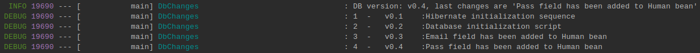

# tt_liquibase

To update database just put changes into /src/main/resources/db/changelog/changes 
Don't be lazy to write rollback
scripts and follow version & id conventions.

## Steps to reproduce

1. Create database using `src/main/resources/db/createDatabase.sql`
2. Import dependencies for selected rdb and liquibase (see pom.xml).
3. Update `src/main/resources/application.properties` with

```properties
   spring.datasource.url=
   spring.datasource.username=
   spring.datasource.password=
   spring.datasource.initialization-mode=never
   spring.jpa.hibernate.ddl-auto=validate
```
4. Create initial file `src/main/resources/db/changelog/db.changelog-master.yaml` It should be named exactly as is.
5. You could use single file, as it in a4eefff0ad293b27cf9c9e09691be02756c11c8c commit, but more preferable way to use `db.changelog-master.yaml` as root and scan directory for updates. 
   
To avoid changing master file (and accidentally broke) it has   
```yaml
- includeAll:
    path: db/changelog/changes 
```
property with tells liquibase scan `changes` folder and include these files into changelog-master.
That way you could focus only on that changes that you create in separate file.
File name doesn't mean and could be used to provide additional info about the update.

Nice bonus - that way logs working much verbose:
```log
Caused by: liquibase.exception.ChangeLogParseException: Syntax error in file db/changelog/changes/v0.3.yaml: while parsing a block mapping
 in 'reader', line 3, column 7:
          tagDatabase:
          ^
expected <block end>, but found '<block mapping start>'
 in 'reader', line 11, column 9:
            rollback:
            ^
```

To track changes should be useful
```sql
select ID, TAG, COMMENTS, FILENAME from DATABASECHANGELOG;
```
I.e. it used in DbChanges.class to pring Db version on application startup

